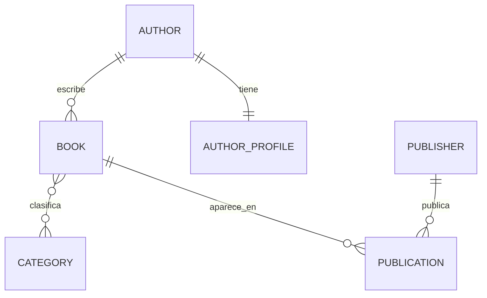

# Laboratorio 04 - Relaciones en Django

## 1. Puesta en marcha

```powershell
py -m venv .venv
.\.venv\Scripts\Activate.ps1
python -m pip install -r requirements.txt
python manage.py migrate
python manage.py seed_demo
python manage.py createsuperuser
python manage.py runserver
```

Abrir `http://127.0.0.1:8000/admin/` para el administrador y `http://127.0.0.1:8000/libros/1/` para el detalle del primer libro.

## 2. Decisiones del modelo

- `Book.autor` es `ForeignKey` porque un autor puede escribir muchos libros y cada libro tiene un autor. El `related_name='libros'` permite `autor.libros.all()`.
- `AuthorProfile.author` es `OneToOneField` porque cada autor tiene un único perfil biográfico separado.
- `Book.categories` es `ManyToManyField` porque un libro puede pertenecer a varias categorías y una categoría puede clasificar muchos libros.
- `Book.publishers` usa `through='Publication'` porque la relación libro-editorial tiene datos propios: fecha de publicación y edición.
- El estado final usa `on_delete=PROTECT` en el autor: impide eliminar un autor que todavía tiene libros y evita pérdida accidental de información.

Diagrama para incluir en la guía:



## 3. Capturas que debes incluir

1. Terminal con `python --version`, `python -m django --version` y la instalación de Pillow.
2. `config/settings.py` mostrando `library` en `INSTALLED_APPS`, `MEDIA_URL` y `MEDIA_ROOT`.
3. `library/models.py` mostrando `ForeignKey`, `OneToOneField`, `ManyToManyField` y `through='Publication'`.
4. Salida de `python manage.py makemigrations library`.
5. Salida de `python manage.py migrate` con `library.0001_initial... OK`.
6. Resultado de la consulta de tablas de SQLite incluida en la siguiente sección.
7. Administrador mostrando los 2 autores.
8. Administrador mostrando los 4 libros.
9. Administrador mostrando las 3 categorías, con un libro asignado al menos a dos.
10. Administrador mostrando las 2 editoriales y las publicaciones con fecha/edición.
11. Consola de Django con las consultas de ida, vuelta y doble guion bajo.
12. Consola mostrando el `ProtectedError` al intentar borrar un autor con libros.
13. Consola mostrando la prueba temporal con `CASCADE` y el registro relacionado eliminado.
14. Navegador en `/libros/1/` mostrando título, categorías, editorial, autor y biografía.
15. Diagrama de modelos con las cardinalidades y una captura del repositorio/entrega.

Recorta las capturas para que se lean los comandos, resultados y la URL o el nombre del archivo relevante. No incluyes contraseñas.

## 4. Tablas creadas

Ejecutar:

```powershell
python manage.py shell -c "from django.db import connection; print('\n'.join(connection.introspection.table_names()))"
```

Deben aparecer, entre otras, `library_author`, `library_authorprofile`, `library_book`, `library_category`, `library_publisher`, `library_publication`, `library_book_categories` y las tablas internas de Django. La tabla `library_book_categories` es la intermedia automática del muchos a muchos de categorías.

## 5. Consultas para registrar

```python
from library.models import Author, Book

libro = Book.objects.get(title='Cien años de soledad')
autor = Author.objects.get(email='gabriel@example.com')

libro.autor
# Resultado: Gabriel Garcia Marquez

autor.libros.all()
# <QuerySet [<Book: Cien años de soledad>, <Book: El amor en los tiempos del colera>]>

Book.objects.filter(autor__name__icontains='garcia')
# <QuerySet [<Book: Cien años de soledad>, <Book: El amor en los tiempos del colera>]>

Book.objects.filter(categories__name='Realismo magico')
# Incluye Cien años de soledad y La casa de los espiritus.
```

Para consultar el intermedio con sus datos propios:

```python
book = Book.objects.get(title='Cien años de soledad')
book.publication_set.all()
# Publicacion con editorial, fecha y edicion
```

## 6. Comparación de `on_delete`

Estado final: `PROTECT`. En la consola:

```python
from django.db.models.deletion import ProtectedError
from library.models import Author

autor = Author.objects.get(email='gabriel@example.com')
try:
    autor.delete()
except ProtectedError as error:
    print(type(error).__name__)
# ProtectedError: Django impide borrar el autor porque tiene libros.
```

Para documentar la comparación, cambia temporalmente `models.PROTECT` por `models.CASCADE`, ejecuta `python manage.py check` y repite la prueba sobre un autor temporal con un libro temporal. Con `CASCADE`, el autor y sus libros dependientes se eliminan automáticamente. Después vuelve a `PROTECT`, ejecuta `python manage.py check` y conserva el código final protegido.

## 7. Pruebas automáticas

```powershell
python manage.py test
```

La suite comprueba las relaciones en ambos sentidos, el bloqueo de borrado y la llegada de los datos relacionados a la plantilla.
